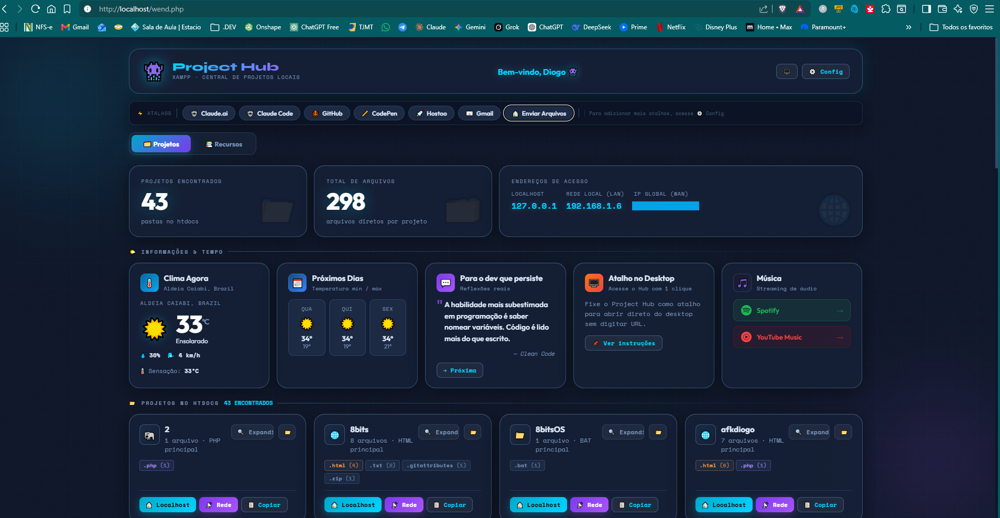
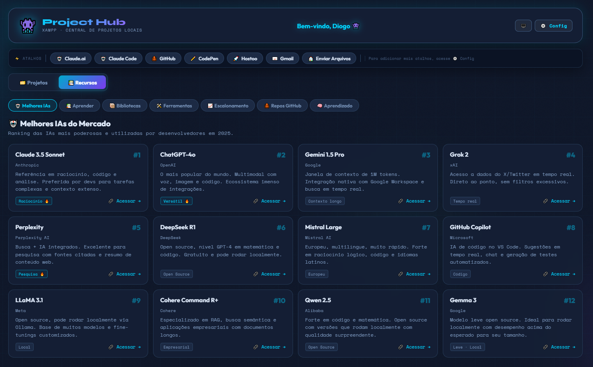
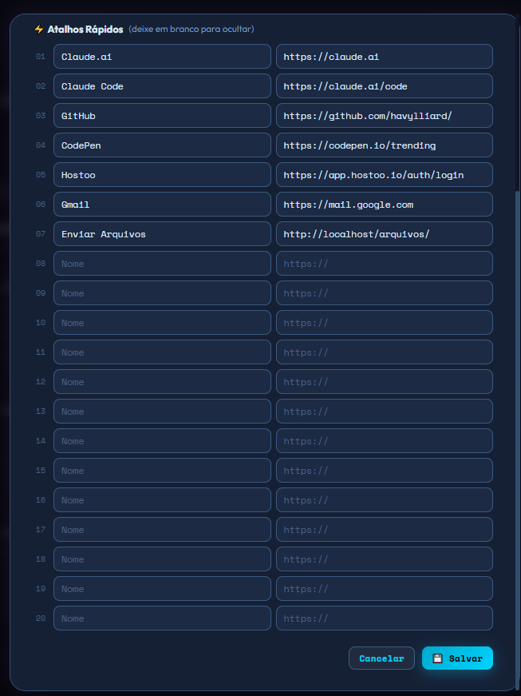

# 👾 XAMPP Project Hub v2.0

**A central inteligente e bonita para gerenciar todos os seus projetos locais no XAMPP.**

Uma dashboard moderna e funcional em **um único arquivo PHP** que transforma sua pasta `htdocs` em um verdadeiro hub de desenvolvimento.

---

## ✨ Funcionalidades

### 🎯 Principais
- **Visualização automática** de todos os projetos/pastas dentro do `htdocs`
- **Acesso rápido** via Localhost e IP da rede (LAN)
- **Botão para abrir pastas diretamente no Explorador de Arquivos** (Windows/Linux/macOS)
- **Análise profunda** de projetos (contagem de arquivos + distribuição por extensão)
- **Estatísticas em tempo real** (total de projetos e arquivos)

### ⚡ Atalhos Personalizáveis
- Até **20 atalhos rápidos** configuráveis
- Suporte nativo a GitHub e CodePen
- Ícones automáticos baseados na URL
- Dock flutuante e elegante

### 🌤️ Informações Úteis
- **Clima atual** e previsão de 3 dias (baseado em localização)
- **Cotações motivacionais** para desenvolvedores (com troca manual)
- **Endereços de acesso** (localhost + IP local + IP público)
- **Música rápida** (Spotify e YouTube Music)

### 📚 Recursos para Devs
- **6 categorias** de links úteis:
  - 🤖 Melhores IAs (2025)
  - 📚 Aprender Programação
  - 📦 Bibliotecas e Frameworks
  - 🛠️ Ferramentas Essenciais
  - 📈 Escalonamento
  - 🐙 Repositórios GitHub
  - 🧠 Técnicas de Aprendizado

### 🎨 Design
- Interface **glassmorphism** moderna e escura
- Totalmente responsiva
- Animações suaves
- Totalmente customizável (nome, atalhos, etc)

---

## 🚀 Como Instalar

1. Baixe o arquivo `index.php`
2. Coloque na raiz do seu XAMPP:  
   `C:\xampp\htdocs\index.php`
3. Acesse no navegador:  
   `http://localhost` ou `http://seu-ip-local`

Pronto! O hub já detecta automaticamente todos os seus projetos.

---

## 📸 Screenshot

---

## 🛠️ Tecnologias Utilizadas

- **PHP 8+**
- **HTML5 + CSS3** (com variáveis CSS modernas)
- **JavaScript** (Vanilla)
- **Tailwind-like** (CSS customizado)
- **Fontes**: Outfit, Space Mono e Syne (Google Fonts)

---

## 📁 Estrutura Recomendada
